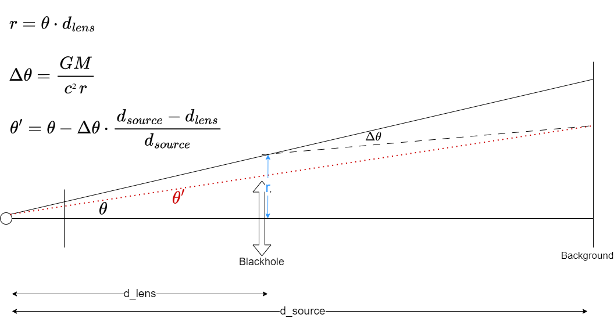

# relativity
Few general relativity test
```
pip install -r requirements.txt
```

## Black hole deformation
Raytracing for blackhole lens effect approximation (schwarschild metric approximation)
```
python blackhole.py
```



## Mercury trajectory
Calculate python trajectory using relativity geodesic
```
python mercury.py
```
 


## Light geodesic
simulate light trajectory
```
python photo_geodesic.py
```
