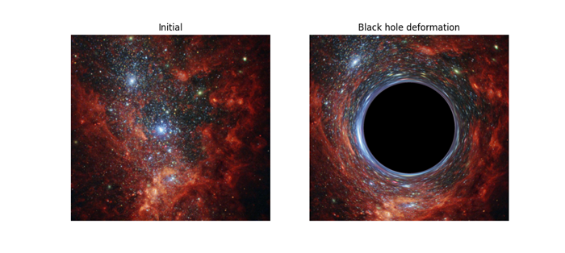
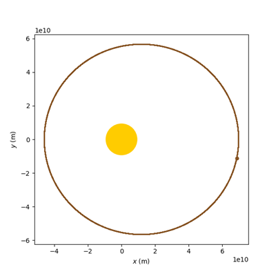
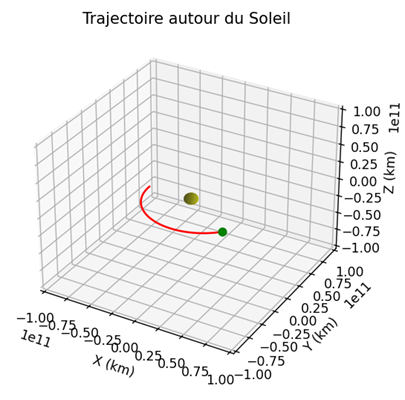
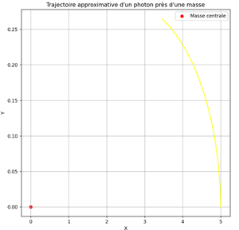

# relativity
Few general relativity test

## Black hole deformation

Raytracing for blackhole lens effect approximation (schwarschild metric approximation)

## Mercury trajectory
 

## Light geodesic
