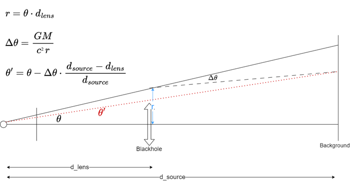
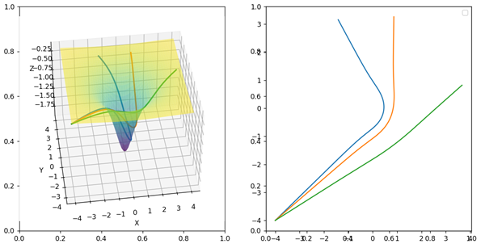
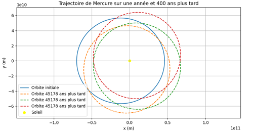

# relativity
Few general relativity test
```
pip install -r requirements.txt
```

## Black hole deformation
Raytracing for blackhole lens effect approximation (schwarschild metric approximation)
```
python blackhole.py
```



## Mercury trajectory
Calculate python trajectory using relativity geodesic
```
python mercury.py
```
 


## Light geodesic
simulate light trajectory
```
python photo_geodesic.py
```


## Geodesic for any curved surface
Draw geodesics for given curved surface equation and initial condition
 - calculate metric from surface equation
 - calculate christoffel symbols
 - integrator to solve geodesic equation

```
python metric.py
```


## Mercury precession
Calculate precession for mercury (newtonian + relativity) and draw orbits 
```
python precession.py
```
